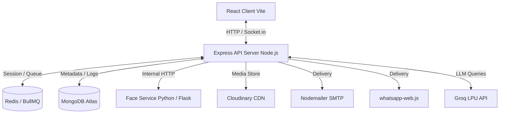

# APES (Agentic Photos Evaluation and Segregation) System
## Project Description

APES (Agentic Photos Evaluation and Segregation) is an AI-powered photo management system designed to bring intelligence and automation to how users organize, search, and share their memories. Unlike traditional photo galleries that rely on manual sorting, APES uses deep learning–based facial recognition, modern event-driven background queues, and natural language understanding to create an intuitive and efficient photo experience. Whether it’s identifying people in images, organizing them into smart folders, or delivering them across platforms, the system ensures seamless photo handling with minimal human effort.

At its core, APES integrates advanced computer vision models such as **InsightFace (buffalo_l)** to achieve highly accurate face detection and recognition. Once photos are uploaded, the system automatically detects and extracts face coordinates, mapping them against user-defined personas. This automation leads to intelligent organization — grouping photos into person-specific collections, maintaining a clean relational hierarchy, and enabling quick retrieval through tags or voice-like queries. The combination of AI-driven recognition and structured folder management makes APES both powerful and user-friendly.

Beyond recognition, APES incorporates a conversational AI chatbot assistant that enables natural interaction with your photo collection. Users can simply ask, “Show me photos of Priya from last month,” or “Send John’s pictures to WhatsApp,” and the system interprets and executes the task using Groq-powered natural language processing. The agent loop is built with multi-model routing (using `llama-3.1-8b-instant` for low-latency queries and `llama-3.3-70b-versatile` for complex multi-step tool calls) and rate-limit/parsing fail-safes. This multimodal interaction turns photo management into an intelligent dialogue, extending functionality beyond search into smart actions like automated sharing, batch delivery, and history tracking.

Built with a modern polyglot microservice architecture, APES uses Node.js with Express for its backend API orchestration, Python Flask for its computer vision Face Service, React.js (Vite) for its frontend, Redis/BullMQ for asynchronous job queues, and MongoDB Atlas for database storage. It features secure token-based authentication, encrypted database records, and direct integrations with email (Nodemailer SMTP) and WhatsApp (via `whatsapp-web.js`). APES is more than a gallery—it’s a personalized photo companion that combines AI, automation, and communication to redefine how users manage and interact with their digital memories.

---

## Scenario 1: Family Photo Organization & Memory Management

Riya, a working professional, has over 15,000 photos collected from years of vacations, family events, and celebrations. Her photo collection is spread across her phone, Google Drive, and an old laptop, making it nearly impossible to find specific pictures quickly. After setting up APES, she uploads her entire photo library through the web interface. The system automatically scans every image, detects faces, and recognizes family members she’s labeled before — like “Mom,” “Dad,” “Ananya,” and “Grandma.”

New faces are flagged for labeling, allowing Riya to tag relatives or friends once, after which APES learns and remembers them for future uploads. The system then organizes all photos into neatly labeled collections, like “Family Trips,” “Weddings,” or “Festivals.” Later, when Riya wants to reminisce, she simply types or says, “Show me photos of Grandma from Diwali 2022,” and within seconds, the AI retrieves exactly those photos. She can even ask, “Email Mom her birthday photos from last year,” and the chatbot automatically attaches and sends them via Gmail. What once took hours now happens effortlessly — transforming Riya’s digital chaos into an intelligent, organized memory archive.

---

## Scenario 2: Event Photographer Workflow Automation

Aarav, a wedding and event photographer, deals with thousands of photos after every event. Sorting, tagging, and delivering photos to clients often takes days. By integrating APES into his post-production workflow, Aarav automates most of this process. Once the event photos are uploaded, APES detects all faces and identifies recurring individuals (like the couple, families, and guests). It groups photos automatically — for example, “Bride & Groom,” “Family Group,” “Candid Moments,” and more.

Aarav can label key people once, and the system remembers them for all future shoots, improving with each upload. Through the built-in chatbot, he can simply command, “Show me all photos of the couple during the ceremony,” or “Send family group photos to client@example.com.” Since event batches frequently exceed standard attachment constraints (e.g., 25MB for Gmail), APES automatically triggers a Socket.io confirmation modal asking Aarav if he wishes to compile and deliver the batch as a compressed archive. Once confirmed, APES streams the photo files in parallel directly from Cloudinary, compresses them in-memory, uploads the raw ZIP back to Cloudinary, sends the PR download proxy link via email or WhatsApp, and logs the history. A BullMQ worker cleans up the temporary ZIP file from Cloudinary 24 hours later, reclaiming storage automatically. This saves Aarav hours of effort and allows him to focus on editing and creativity instead of logistics.

---

## Scenario 3: Corporate Media Management & Collaboration

At a digital marketing agency, the creative team handles thousands of images for different campaigns and clients. These include event photos, product launches, and press coverage. Over time, managing and retrieving these visuals becomes a challenge, especially when multiple teams are involved. The company deploys APES as its central AI-powered media management platform. Whenever team members upload campaign photos, the system automatically detects people, identifies employees, clients, and public figures, and organizes them into structured folders like “Client A – Launch 2024,” “Team Events,” or “Brand Photoshoots.”

When the marketing lead, Neha, needs visuals for a quarterly report, she doesn’t dig through shared drives. Instead, she asks the chatbot, “Find all photos of Rohan and Priya from the Client A launch event,” and APES instantly retrieves them. She can then say, “Email them to our PR team,” and the AI handles it seamlessly. The delivery is logged automatically in the MongoDB `DeliveryHistory` collection for compliance and tracking. This automation not only saves time but also enhances collaboration, security, and brand consistency across projects — making APES an indispensable tool for modern media teams.

---

## Architecture

APES is designed as a polyglot microservice system. Below is the diagrammatic representation of the system architecture detailing component interfaces, data storage, and external integrations:



### [IMAGE PLACEHOLDER 1: System Architecture Diagram]
> **Instructions for the User:** Replace this placeholder with a screenshot of the system architecture diagram or a rendered version of the Mermaid diagram above. It should illustrate the React Client connecting to the Node.js Express Backend via Socket.io and HTTP, which in turn coordinates with Redis (BullMQ), MongoDB Atlas, the Python Flask Face Service (InsightFace), Cloudinary CDN, Nodemailer SMTP, whatsapp-web.js, and Groq API.

### Pre-requisites:
1. **Python Environment Setup**: Install Python 3.9+ (required for `insightface` and compatible scientific packages) and set up a virtual environment inside the `face-service/` directory.
2. **Node.js Installation**: Install Node.js 18+ (includes npm 9+) to support Vite, Express, ES modules, and modern JavaScript dependencies.
3. **Backend Dependencies**: Initialize and install package manager dependencies inside the `backend/` directory by executing `npm install`.
4. **Face Service Dependencies**: Install required scientific and framework packages inside the `face-service/` directory using `pip install -r requirements.txt`.
5. **Database Setup**: Configure a MongoDB database named `apes` (either locally or via MongoDB Atlas cloud cluster).
6. **Backend Configuration**: Create a `.env` file in the `backend/` directory with configurations for Port, Database connections, Redis server, Groq API credentials, Cloudinary API access, Gmail credentials, and other system tokens.
7. **Face Service Configuration**: Create a `.env` file in the `face-service/` directory specifying the development port (defaulting to `5001`).
8. **Frontend Configuration**: Create a `.env` file in the `frontend/` directory specifying variables such as `VITE_API_URL=http://localhost:5000` and `VITE_SOCKET_URL=http://localhost:5000`.
9. **Backend Launch**: Run the development command `npm run dev` to start the Node.js Express server, and execute `python app.py` (after activating `venv`) to start the Python Flask face-service.
10. **Frontend Launch**: Start the React client with Vite by running `npm run dev` in the `frontend/` directory.
11. **Verification**: Confirm backend and Socket.io endpoints are running on http://localhost:5000, Flask Face Service is listening on http://localhost:5001, and the Vite UI client is accessible on http://localhost:5173.

---

## Project WorkFlow

### Milestone 1: Environment Setup and Project Initialization

#### Activity 1.1: Create and activate a Python virtual environment using python -m venv venv.
To isolate Python libraries for the computer vision components, install Python 3.9+ on your computer and navigate to the `face-service/` directory. Create a new virtual environment using the command `python -m venv venv`. Once generated, activate it using the appropriate terminal command:
* Windows PowerShell: `venv\Scripts\Activate.ps1`
* Windows Command Prompt: `venv\Scripts\activate.bat`
* macOS/Linux Shell: `source venv/bin/activate`

This isolates dependencies like `insightface`, `onnxruntime`, and OpenCV, avoiding global library version conflicts.

### [IMAGE PLACEHOLDER 2: Virtual Environment Setup]
> **Instructions for the User:** Take a screenshot of the terminal inside the [face-service/](file:///d:/APES/face-service) directory showing the execution of `python -m venv venv` and the subsequent activation command (e.g. `.\venv\Scripts\activate`), with the `(venv)` prefix displayed on the prompt.

#### Activity 1.2: Set up the project folder structure for backend (Express), face-service (Flask), and frontend (React.js/Vite).
Organize the project into logical sub-repositories to establish separation of concerns:
* `backend/`: Node.js Express workspace containing controllers, database models, background BullMQ workers, routes, services, and configuration.
* `face-service/`: Python Flask service dedicated to running the ONNX models for face analysis.
* `frontend/`: React single page application initialized with Vite, using Tailwind CSS v4.0 for styling.
* `shared/`: Shared assets, utilities, and helper functions.
* `docs/`: System documentation, API contracts, design decisions, and system feature maps.

### [IMAGE PLACEHOLDER 3: Directory Structure File Tree]
> **Instructions for the User:** Take a screenshot of your VS Code workspace explorer showing the expanded root directory containing [backend/](file:///d:/APES/backend), [face-service/](file:///d:/APES/face-service), [frontend/](file:///d:/APES/frontend), [shared/](file:///d:/APES/shared), and [docs/](file:///d:/APES/docs) folders, showing a clean top-level repository outline.

#### Activity 1.3: Configure .env files for backend, face-service, and frontend with required API keys, database URLs, and Cloudinary keys.
To secure application keys and parameters, setup isolated environment files:
* In `backend/.env`, declare fields for port configurations (`PORT`), database URIs (`MONGO_URI`), Redis caches (`REDIS_URL`), Groq tokens (`GROQ_API_KEY`), Cloudinary URLs (`CLOUDINARY_URL`), Nodemailer accounts (`GMAIL_EMAIL`, `GMAIL_PASSWORD`), and JWT security secrets.
* In `face-service/.env`, configure ports (`PORT=5001`).
* In `frontend/.env`, configure Vite client endpoints (`VITE_API_URL=http://localhost:5000` and `VITE_SOCKET_URL=http://localhost:5000`).

Ensure all `.env` files are appended to `.gitignore` to prevent leaking credentials.

The core services integrated in APES include:
1. **Groq API**: Powering the conversational assistant client. Requests are evaluated and routed to `llama-3.1-8b-instant` or `llama-3.3-70b-versatile` depending on intent complexity.
2. **Gmail API / SMTP Nodemailer**: Connecting to Google's SMTP servers using app-specific passwords to deliver photo batches safely.
3. **WhatsApp Web API**: Using the `whatsapp-web.js` library to automate photo delivery to mobile numbers via a local QR-authenticated WhatsApp session.
4. **InsightFace Model (buffalo_l)**: Python library loaded dynamically on first runtime. Pre-trained weights are cached to run offline face bounding box detection and 512-dimension vector embedding generation.

### [IMAGE PLACEHOLDER 4: Backend .env Structure]
> **Instructions for the User:** Take a screenshot of your [backend/.env](file:///d:/APES/backend/.env) file showing the environment variables (`PORT`, `MONGO_URI`, `REDIS_URL`, `GROQ_API_KEY`, etc.) with keys masked or populated with placeholder values.

#### Activity 1.4: Install dependencies using npm install and pip install.
Execute package installers in each workspace:
* Backend: Navigate to `backend/` and run `npm install` to install dependencies such as `express`, `mongoose`, `redis`, `bullmq`, `socket.io`, `archiver`, and `nodemailer`.
* Face Service: Navigate to `face-service/` and run `pip install -r requirements.txt` (inside the virtual environment) to install libraries like `flask`, `insightface`, `onnxruntime`, `opencv-python`, and `numpy`.
* Frontend: Navigate to `frontend/` and run `npm install` to load React, Tailwind CSS v4.0, Axios, Socket.io-client, Lucide React, and Framer Motion.

### [IMAGE PLACEHOLDER 5: Dependency Installation Terminal Log]
> **Instructions for the User:** Take a screenshot of the terminal log outputs after executing `npm install` inside the [backend/](file:///d:/APES/backend) directory or running `pip install -r requirements.txt` inside the activated virtual environment of [face-service/](file:///d:/APES/face-service), showing successful package outputs.

#### Activity 1.5: Verify environment setup and ensure reproducible builds.
Verify the environment configurations by booting the service instances:
1. Start the Flask Face Service: `python app.py` (verifying model load).
2. Start the Express API Server: `npm run dev` (verifying Mongo and Redis connection states).
3. Start the React Frontend: `npm run dev` (verifying local Vite webserver boot).
Confirm files like `package-lock.json` and requirements lists are tracked in git to lock exact dependency chains.

### [IMAGE PLACEHOLDER 6: Service Run Logs]
> **Instructions for the User:** Capture a screenshot of split terminals in VS Code showing the successful launch logs of the [backend/src/index.js](file:///d:/APES/backend/src/index.js) Express server, [face-service/app.py](file:///d:/APES/face-service/app.py) Flask server, and [frontend/src/main.jsx](file:///d:/APES/frontend/src/main.jsx) Vite compiler running concurrently.

---

### Milestone 2: Backend API Development using Express (Node.js)

#### Activity 2.1: Develop RESTful API endpoints for photo management, face labeling, and chatbot functionalities.
Create modular Express controllers mapped under the `/api/v1` namespace. Core endpoints include:
* `POST /api/v1/photos/upload`: Handles uploaded multipart/form-data images, sends files to Cloudinary, inserts a photo model status as 'processing', and adds face-recognition jobs.
* `GET /api/v1/photos`: Retrieves all uploaded photos.
* `POST /api/v1/faces/label`: Associates an unlabeled face centroid with a named `Person` document, triggering cascading label updates.
* `POST /api/v1/chat`: Exposes chatbot reasoning interface, feeding history to the Groq agent loop.
* `GET /api/v1/delivery/download/:deliveryId`: Proxy-streams compiled ZIP files directly from Cloudinary raw assets to download endpoints.

### [IMAGE PLACEHOLDER 7: Express Router Configuration Code]
> **Instructions for the User:** Take a screenshot of the routing configuration inside [backend/src/routes/photo.routes.js](file:///d:/APES/backend/src/routes/photo.routes.js) or the main routing entry point [backend/src/app.js](file:///d:/APES/backend/src/app.js), focusing on where the HTTP methods are bound to controller callbacks.

#### Activity 2.2: Define Mongoose database schemas for User, Photo, Face, Person, ChatHistory, and DeliveryHistory.
Implement relational mappings inside the database layer using Mongoose models:
* `User`: Holds accounts, email addresses, password hashes, and profile timestamps.
* `Photo`: Stores Cloudinary URLs, file identifiers, original byte sizes, related face object reference arrays, user reference, and processing states (`processing`, `completed`, `error`).
* `Face`: Stores bounding box coordinates (`x`, `y`, `w`, `h`), 512-dimension floating-point face vector embeddings, parent photo ID, associated named Person ID, and identification flags (`isLabeled`).
* `Person`: Holds defined names (e.g. "Mom"), creator user references, and centroid embeddings (average vector profile).
* `ChatHistory`: Logs chat exchanges between users and the agent.
* `DeliveryHistory`: Tracks photo shares, email/WhatsApp recipients, zip statuses (`pending`, `queued`, `delivered`), Cloudinary ZIP public IDs, URLs, and cleanup timestamps.

### [IMAGE PLACEHOLDER 8: Mongoose Schema Definitions]
> **Instructions for the User:** Take a screenshot of the [backend/src/models/Photo.js](file:///d:/APES/backend/src/models/Photo.js) or [backend/src/models/Face.js](file:///d:/APES/backend/src/models/Face.js) file showing the Mongoose schema definition with property fields, validation boundaries, and relational hooks.

#### Activity 2.3: Implement database initialization with Mongoose connection and ensure schema consistency.
Create database connection configuration utilities. Connect to MongoDB inside the boot file [index.js](file:///d:/APES/backend/src/index.js):
```javascript
import mongoose from "mongoose";
export const connectDB = async () => {
  try {
    await mongoose.connect(process.env.MONGO_URI);
    logger.info("Connected to MongoDB successfully");
  } catch (error) {
    logger.error("Failed to connect to MongoDB", error);
    process.exit(1);
  }
};
```
Define schemas uniformly. Any index adjustments or constraint modifications are deployed synchronously at boot.

### [IMAGE PLACEHOLDER 9: Database Connection Code]
> **Instructions for the User:** Take a screenshot of the database client initialization inside [backend/src/config/db.js](file:///d:/APES/backend/src/config/db.js) showing the Mongoose connection code.

#### Activity 2.4: Create modular controllers for core services — Photo Ingestion, Face Processing, Chat Assistant, and Delivery Integration.
Encapsulate the business logic within controllers inside `backend/src/controllers/`:
* `photo.controller.js`: Coordinates file parses, writes to Cloudinary CDN, creates document instances, and triggers BullMQ recognition jobs.
* `face.controller.js`: Serves face coordinates, lists unlabeled crops, manages manual annotations, and runs label propagation.
* `chat.controller.js`: Wraps session loads, agent loop executions, and JSON returns.
* `delivery.controller.js`: Processes download proxies and audit requests.

### [IMAGE PLACEHOLDER 10: Ingestion Controller Code]
> **Instructions for the User:** Take a screenshot of the file upload controller method (e.g. `uploadPhoto` in [backend/src/controllers/photo.controller.js](file:///d:/APES/backend/src/controllers/photo.controller.js)), displaying the asynchronous steps from Cloudinary stream pipe to BullMQ job insertion.

#### Activity 2.5: Implement authentication using JWT-based token access and secure password hashing.
Ensure workspace routes are protected. When users submit registration or login commands, encrypt user passwords using `bcrypt` (with 10 hashing rounds) before saving them to the database. Authenticate users by signing JSON Web Tokens (JWT) containing user identifiers and security payloads. Protect API routers using authentication middleware that validates token payloads from Request headers before executing controllers.

### [IMAGE PLACEHOLDER 11: JWT Security Middleware]
> **Instructions for the User:** Take a screenshot of the authentication validation middleware inside [backend/src/middlewares/auth.js](file:///d:/APES/backend/src/middlewares/auth.js) showing how tokens are extracted from headers and parsed.

---

### Milestone 3: AI and Service Integration (InsightFace, Groq, Gmail, WhatsApp, and BullMQ)

#### Activity 3.1: Integrate Python Face Service with InsightFace (buffalo_l) models for robust face detection and vector embeddings generation.
Inside `face-service/`, configure the Flask endpoint `/recognize` which maps calls to `face_service.py`:
1. Receives photo URLs, downloads the file binary from Cloudinary, and reads it using OpenCV.
2. Executes the InsightFace `FaceAnalysis(name="buffalo_l")` model to locate face objects and compute 512-dimension vector representations.
3. Applies IoU-based Non-Maximum Suppression (NMS) to eliminate duplicate detection bounding boxes.
4. Returns coordinates and embeddings to the Node.js background queue worker.

Inside the BullMQ worker:
* Calculates cosine similarity of the newly extracted embeddings against the user's existing Person centroids.
* Auto-labels faces with high similarity matches, and marks unknown profiles as unlabeled crops.

### [IMAGE PLACEHOLDER 12: Python InsightFace Integration Code]
> **Instructions for the User:** Take a screenshot of the core face analysis and NMS deduplication code inside [face-service/services/face_service.py](file:///d:/APES/face-service/services/face_service.py), specifically highlighting the `extract_embeddings` or `deduplicate_faces` helper functions.

#### Activity 3.2: Develop the AI Chat Assistant using Groq API with fallback routing and manual tool parsing.
Implement the agent orchestrator inside [agentLoop.js](file:///d:/APES/backend/src/agent/agentLoop.js):
* **Model Routing**: Evaluation logic routes conversational inputs to `llama-3.1-8b-instant` and complex actions to `llama-3.3-70b-versatile`.
* **Fallback Systems**: Catches 429 rate limit exceptions, automatically switching active contexts to alternative models.
* **Manual Regex Parser**: Incorporates a parser `parseFailedGeneration` to capture raw JSON tool call strings from gateway error outputs when standard JSON tokenization fails, ensuring seamless operation.

### [IMAGE PLACEHOLDER 13: Agent Execution Loop Code]
> **Instructions for the User:** Take a screenshot of [backend/src/agent/agentLoop.js](file:///d:/APES/backend/src/agent/agentLoop.js) focusing on the `runAgent` loop where model fallbacks and manual tool-calling parsing (`parseFailedGeneration`) are defined.

#### Activity 3.3: Implement Email Delivery with Nodemailer SMTP and smart ZIP compilation.
Set up standard mailing utilities using Nodemailer SMTP. When sharing photo sets:
1. Calculates cumulative payload file sizes from the database.
2. If size stays below 25MB, dispatches direct files.
3. If it exceeds 25MB, prompts user via Socket.io (`delivery:zip-confirm`) to compress the files.
4. On confirmation, downloads photos, compiles a ZIP archive in-memory using `archiver`, uploads it to Cloudinary as a raw resource, and emails the proxy download endpoint link.

### [IMAGE PLACEHOLDER 14: ZIP Packaging Service Code]
> **Instructions for the User:** Take a screenshot of the in-memory compression flow inside [backend/src/services/zip.service.js](file:///d:/APES/backend/src/services/zip.service.js), specifically the `createZip` function demonstrating the parallel downloads and archiver streams.

#### Activity 3.4: Integrate WhatsApp delivery using whatsapp-web.js and size-based checks.
Implement WhatsApp sharing via the `whatsapp.service.js` utility. The backend initializes `whatsapp-web.js`, writing authentication files locally and outputting QR codes to console setups on startup. When dispatches are requested, checks sizes against a 100MB threshold. Exceeding batches are compiled into raw ZIP files on Cloudinary and delivered as download proxy links.

### [IMAGE PLACEHOLDER 15: WhatsApp Client Media Dispatch Code]
> **Instructions for the User:** Take a screenshot of the WhatsApp send function inside [backend/src/services/whatsapp.service.js](file:///d:/APES/backend/src/services/whatsapp.service.js) showing the client interface delivering text messages and media attachments.

#### Activity 3.5: Build background queues (BullMQ) for asynchronous processing, recognition, and asset cleanup.
Establish three separate queues inside Redis:
* `recognitionQueue`: Handles face ingestion tasks for newly uploaded photos.
* `deliveryQueue`: Offloads email and WhatsApp photo deliveries.
* `zipCleanupQueue`: Runs a cron job every 24 hours to identify expired raw ZIP assets in Cloudinary, call the Cloudinary destruction API, and clear database records to reclaim storage.

### [IMAGE PLACEHOLDER 16: Temporary ZIP Cleanup Worker Code]
> **Instructions for the User:** Take a screenshot of the deletion cron worker script in [backend/src/workers/cleanupZip.worker.js](file:///d:/APES/backend/src/workers/cleanupZip.worker.js) showing how expired ZIP records are identified and cleared from Cloudinary and MongoDB.

---

### Milestone 4: React.js Vite Frontend Development

#### Activity 4.1: Design a responsive and intuitive dashboard-style user interface with React, Vite, and Tailwind CSS v4.0.
Build a modern interface layout in React:
* Initialized using Vite for rapid builds and asset processing.
* Styled using Tailwind CSS v4.0 for dark-mode features and animations.
* Set up standard layouts containing a navigation Sidebar, header actions, and alert toasts.
* Configure routes inside `AppRouter.jsx` to navigate between Dashboard, Gallery, Upload, Faces, and Chat.

### [IMAGE PLACEHOLDER 17: React Frontend Router Code]
> **Instructions for the User:** Take a screenshot of the routing configuration inside [frontend/src/router/AppRouter.jsx](file:///d:/APES/frontend/src/router/AppRouter.jsx) showing the frontend view layout configuration.

#### Activity 4.2: Implement photo upload dropzone, face labeling overlay canvas, and photo gallery components with state management.
Implement key interactive UI views:
* **Upload Dropzone**: Accepts files, displays drag animations, lists queue progress, and communicates ingestion status.
* **Gallery Grid**: Renders chronological card lists, supports photo selections, and includes detail modal overlays.
* **Face Labeling Canvas**: Draws face bounding boxes over images. Clicking boxes displays centroid suggestions and allows users to submit labels.

### [IMAGE PLACEHOLDER 18: Face Labeling UI Component Code]
> **Instructions for the User:** Take a screenshot of the rendering code inside [frontend/src/pages/FaceLabelingPage.jsx](file:///d:/APES/frontend/src/pages/FaceLabelingPage.jsx) showing the image overlays and bounding box canvas layers.

#### Activity 4.3: Develop the conversational chatbot interface with dynamic tool result grid cards.
Build the conversational client in `Chat.jsx`:
* Contains messaging input fields, typing notifications, and bubble layouts.
* Integrates custom result renderers. When the agent uses `searchPhotos`, the API includes metadata details in the response, and the chat renders interactive cards displaying photo matches directly in the conversation.

### [IMAGE PLACEHOLDER 19: Chat UI Component Code]
> **Instructions for the User:** Take a screenshot of the chat interface rendering code inside [frontend/src/pages/Chat.jsx](file:///d:/APES/frontend/src/pages/Chat.jsx), specifically where tool result photo grid cards are dynamically mapped.

#### Activity 4.4: Integrate Socket.io for real-time ingestion status and delivery progress notifications.
Initialize Socket.io listeners inside the React views. Subscribes to backend events:
* `recognition:progress`: Updates progress bars on the upload dropzone.
* `delivery:zip-confirm`: Displays confirmation prompts if attachment sizes exceed limits.
* `delivery:started` / `delivery:done`: Displays success notifications to users.

### [IMAGE PLACEHOLDER 20: Socket.io Client Implementation Code]
> **Instructions for the User:** Take a screenshot of the Socket.io initializations or custom hook files in the frontend (e.g. inside [frontend/src/main.jsx](file:///d:/APES/frontend/src/main.jsx) or dashboard event handlers), displaying the event listener registrations.

#### Activity 4.5: Configure environment variables with VITE_API_URL and optimize Vite builds for deployment.
Create a local `.env` file declaring `VITE_API_URL`. Configure client builds:
* Use `import.meta.env.VITE_API_URL` to point Axios calls dynamically to backend ports.
* Execute `npm run build` to compile minimized index packages. Use code-splitting, tree-shaking, and asset compression to optimize payload delivery.

### [IMAGE PLACEHOLDER 21: Vite Configuration Code]
> **Instructions for the User:** Take a screenshot of [frontend/vite.config.js](file:///d:/APES/frontend/vite.config.js) displaying Vite compiler optimization parameters.

---

### Milestone 5: Testing and Deployment

#### Activity 5.1: Conduct backend unit testing for face services, agent loop, and email/WhatsApp functions.
Implement automated test cases for the Express backend and Python face service:
* Create unit tests simulating InsightFace runs on mock images to verify bounding boxes.
* Simulate agent loop requests, mocking Groq API outputs to verify model routing, rate-limit fallbacks, and token calculations.
* Use Sinon or Jest mocks to simulate SMTP transfers and WhatsApp client sends without executing real network calls.

### [IMAGE PLACEHOLDER 22: Backend Test Execution Output]
> **Instructions for the User:** Take a screenshot of your terminal after running unit tests (e.g., `npm test` or `pytest`), showing all test suites passing successfully.

#### Activity 5.2: Perform frontend testing for component rendering, route accessibility, and chat flow validation.
Verify user views using Jest or React Testing Library:
* Confirm Login and Dashboard views load.
* Test that clicking gallery uploads triggers post requests.
* Validate that Socket.io state messages render notifications correctly.

### [IMAGE PLACEHOLDER 23: Frontend Test Suite Code]
> **Instructions for the User:** Take a screenshot of the frontend testing code or terminal outputs executing test specs inside the `frontend/` directory.

#### Activity 5.3: Validate backend–frontend integration and ensure accurate real-time data synchronization.
Perform integration checks across all modules:
1. Upload a test photo from the React upload page.
2. Confirm the progress bar rises in response to `recognition:progress` socket updates.
3. Open database collections and verify coordinates match the image faces.
4. Verify the new profiles appear in the face labeling gallery view.

### [IMAGE PLACEHOLDER 24: Chrome Network Tab Websocket Frames]
> **Instructions for the User:** Capture a screenshot of the Google Chrome browser developer tools' Network tab showing WebSocket frames during a photo upload ingestion process.

#### Activity 5.4: Perform end-to-end output validation, delivery tracking audits, and storage reclamation tests.
Verify sharing flows and cron operations:
* Trigger oversized delivery requests via the chatbot, confirm zip creations via prompt modals, and check email inboxes for zip proxy links.
* Access MongoDB databases using Compass to check that `DeliveryHistory` documents log transactions correctly.
* Manually run BullMQ zip cleanup jobs to confirm expired zip files are successfully deleted from Cloudinary.

### [IMAGE PLACEHOLDER 25: DeliveryHistory Documents in MongoDB Compass]
> **Instructions for the User:** Take a screenshot of MongoDB Compass (or a terminal query log) displaying populated `DeliveryHistory` documents with fields like `zipUrl`, `cloudinaryPublicId`, and `status: "delivered"`.

#### Activity 5.5: Deploy production build using Docker, configure Nginx reverse proxy, and enable SSL.
Prepare deployment files:
* Build Dockerfiles for `backend/`, `face-service/`, and `frontend/` environments.
* Create a master `docker-compose.yml` linking container instances with database endpoints.
* Deploy Nginx configurations to reverse proxy port 80/443 traffic to target app containers, securing endpoints using SSL certificates.

### [IMAGE PLACEHOLDER 26: Docker Compose Orchestration File]
> **Instructions for the User:** Take a screenshot of the `docker-compose.yml` orchestration file inside your project root, showing service configurations for app layers, databases, and reverse proxies.

---

## Home Page (Login and SignUp page)

The Home Page acts as the entry point to the APES system. It presents responsive Login and SignUp forms styled with Tailwind CSS, utilizing JWT-based session security.

### [IMAGE PLACEHOLDER 27: Home / Login UI Page View]
> **Instructions for the User:** Replace this placeholder with a browser screenshot of the Login page interface. It should showcase the clean input forms, security fields, register navigation buttons, and responsive layouts.

---

## DashBoard Page

The APES Dashboard provides a centralized command center for users, showing current socket status, library statistics, and visual storage widgets.

### [IMAGE PLACEHOLDER 28: Dashboard Interface UI Page View]
> **Instructions for the User:** Replace this placeholder with a browser screenshot of the Dashboard view page. The image should display the green `Connected` socket status badge, widgets for database counts, the custom storage progress bar widget, and the activity feed log.

---

## Gallery Page

The Gallery Page displays all uploaded photos in a chronological grid, featuring selection tools, deletion modals, and carousel overlays.

### [IMAGE PLACEHOLDER 29: Gallery Interface UI Page View]
> **Instructions for the User:** Replace this placeholder with a browser screenshot of the Gallery interface. It should demonstrate the photo grid, checkmark toggles for batch photo selection, the delete confirmation modal, and the details carousel displaying photo overlays.

---

## Chatbot Page

The Chatbot interface allows users to search, organize, and share their media collections using natural language chat commands.

### [IMAGE PLACEHOLDER 30: Chatbot Interface UI Page View]
> **Instructions for the User:** Replace this placeholder with a browser screenshot of the Chat client page. It should show a conversational exchange (e.g. asking for photos), a typing state indicator, and interactive photo result card grids returned by the search tool.

---

## Conclusion

The successful implementation of the APES (Agentic Photos Evaluation and Segregation) system demonstrates the power of combining modern containerized polyglot microservices with machine learning and agentic workflows. By integrating the high-performance **InsightFace (buffalo_l)** face detection models with a Node.js Express orchestrator and React Vite client, the system achieves fast and accurate face detection, embedding generation, and automatic categorization. 

Key architectural innovations — such as Redis-backed background queues using **BullMQ**, automated in-memory ZIP streaming, and robust multi-model Groq API routing with fallback structures — ensure that the application remains responsive, secure, and resilient under heavy workloads. By addressing the manual organization bottleneck of photo collections, APES bridges the gap between advanced deep learning and everyday utility, delivering an intelligent photo companion that recognizes, organizes, and shares memories with precision and ease.
