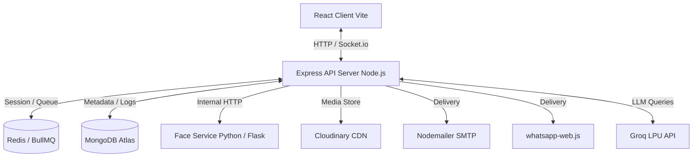
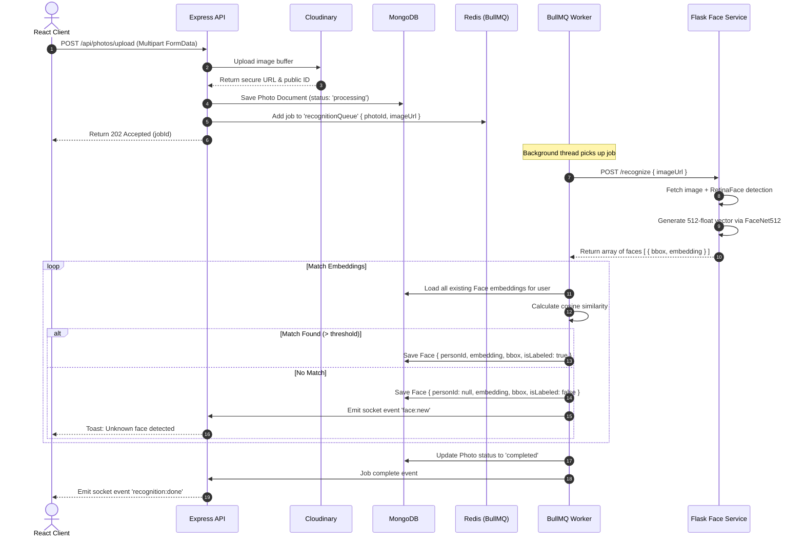
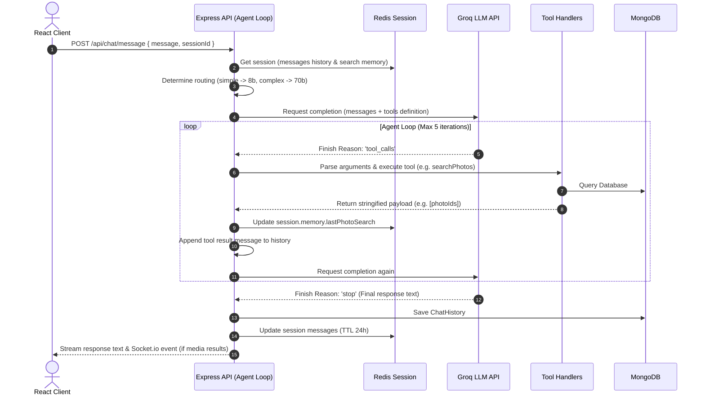

# APES — System Architecture

This document describes the high-level design, component boundaries, and core workflows of the APES (Agentic Photos Evaluation and Segregation) AI-powered photo management system.

## 1. System Overview

APES is built as a polyglot microservice architecture designed to handle photo storage, automatic face recognition, natural language retrieval, and action dispatching.

### Component Boundaries
- **React Client (Vite):** Visualizer layer. Standard React SPA, styling done via Tailwind. Renders the gallery, overlay canvas for face labeling, real-time toast alerts, and a chat interface. Communicates via Socket.io and Axios.
- **Express API (Node.js):** The orchestration core. Owns the REST API, websocket channels (via Socket.io), session routing, database schemas (via Mongoose), and the agent loop.
- **Python Face Service (Flask):** The machine learning processor. Wrapped in a simple Flask wrapper. Accepts image URLs, runs RetinaFace to localise bounding boxes, and generates 512-dimensional float embeddings using FaceNet512.
- **Redis (Upstash/Local):** Serves two distinct namespaces:
  1. *BullMQ Job Queues:* Organises asynchronous tasks for face extraction, email sending, and WhatsApp delivery.
  2. *Session Store:* Caches chat history and state contexts with a 24-hour TTL.
- **MongoDB Atlas:** Ephemeral-to-persistent storage. Holds records for users, photos, faces, named people, and delivery/chat audits.

---

## 2. Core Workflows

### Workflow A: Photo Upload & Processing Pipeline
When a user uploads a batch of files, the system processes them asynchronously using BullMQ workers.

---

### Workflow B: Agent Query & Action Flow
This workflow describes how a natural language request is routed, processed in a loop, and translated into backend actions.

